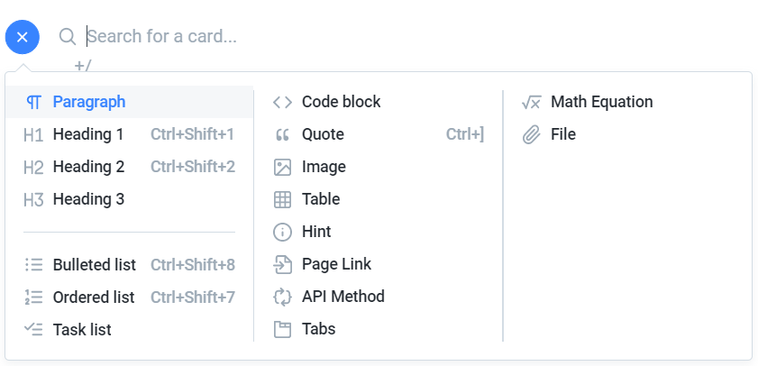

# 合作方法

**注：这部分内容是霁儿快速入门gitbook摸索出来的。很可能不全面 or 有很多错误，欢迎补充**

主要的合作方法有两种：在gitbook.com上在线编辑，和直接编辑源码在github.com上合作。对于有git基础和markdown基础的contributor建议用github.com。

## 在gitbook.com在线编辑

1. 登陆gitbook.com。如果没有账号，需要新注册账号。
2. 加入USTC Survival Manual contributor group。自行联系相关人员加入
3. 进入书籍编辑页面 [https://app.gitbook.com/@ustc-sist-survival-manual/s/ustc/](https://app.gitbook.com/@ustc-sist-survival-manual/s/ustc/)，点击每个page即可开始编辑
4. 新建内容：gitbook仅支持二级目录，新建文件夹点击New - New Group，新建文件点击New - New Page即可。
5. 具体编辑：编辑大体使用markdown语法，但用图形界面配置文本格式可能更方便。编辑左侧界面（v）展开能够展开编辑文本格式如下图；鼠标悬浮于光标处，或选择一段文本，可以看到黑色的（+），展开可以看到其他文本格式配置方法。懒得放图。
6. 保存修改：在gitbook.com上作出任何修改后左下角会有一个大大的绿色Save。点击Save即保存
7. 提交修改：保存修改后，左下角有一个紫色Merge。点击Merge即可，再访问用于阅读的网址就会有刚刚编辑的内容。

 

点击后成为：

  

（小声说，gitbook.com比较容易卡，个人觉得编辑器不太人性化，而且不方便定制特性。

## 直接编辑源码在github.com上合作

我们的github repo为[USTC-SIST-Survival-Manual](https://github.com/shirley-wu/USTC-SIST-Survival-Manual)。Gitbook仅支持两级目录。为了和gitbook.com在线编辑生成的文件保持一致，个人建议每个文件夹表示一个Group（即，一级目录。如文件夹`zhi-nan-shi-yong-fang-fa/`），一个文件表示一个Page（即，实际内容。如文件`zhi-nan-shi-yong-fang-fa/he-zuo-fang-fa.md`）。编辑方法：

1. Clone github repo到本地
2. 找到 or 新建markdown文件，并编辑。使用markdown语法。如果新建文件，需要将文件写入`SUMMARY.md`才能被gitbook追踪。`SUMMARY.md`中，二级标题（`##`）表示Group，列表（`*`）表示Page。TODO：研究一下能不能用多级列表。
3. git add，git commit
4. Markdown编辑器推荐使用typora

commit之后，如果是github repo的contributor，直接pull & push即可。如果不是，开一个pull request即可。

（既然看到这里我默认大家都有github基础，就不详细介绍了……）

